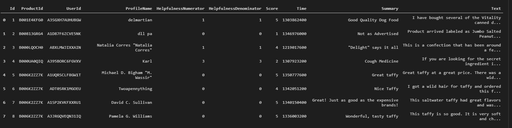
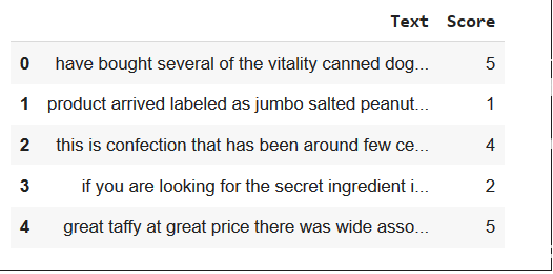
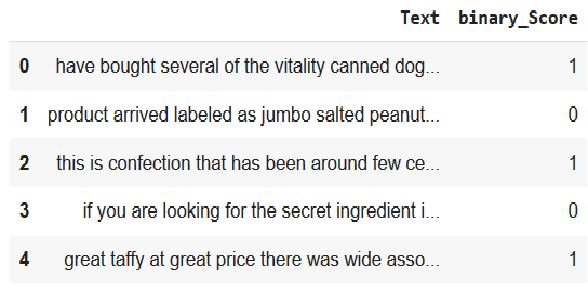
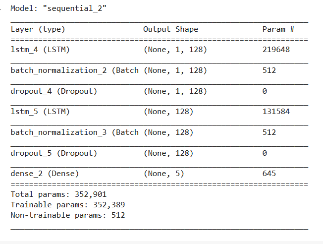
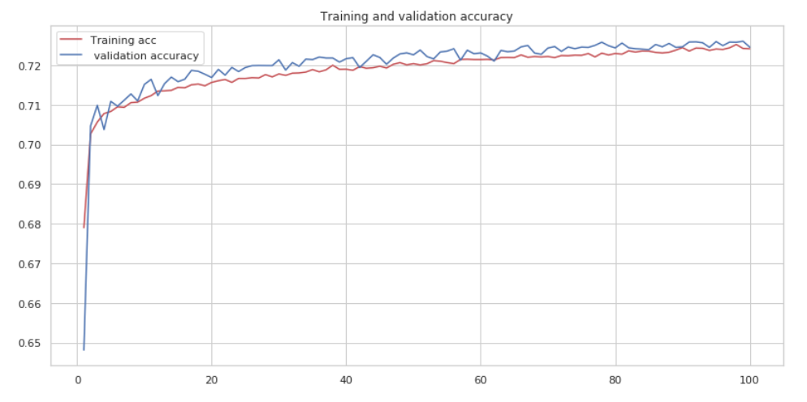
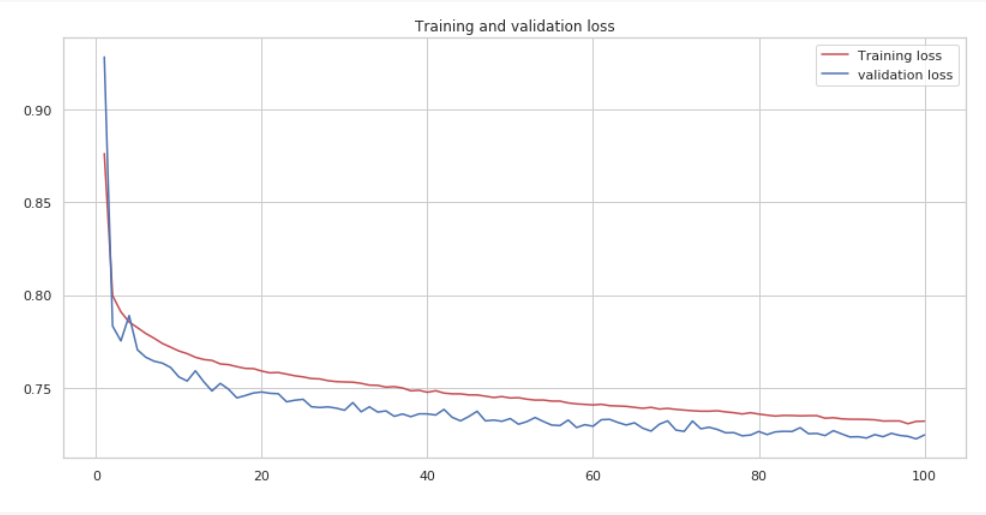

# **Text sentiment analysis on Amazon Fine Food Reviews**

> Note: This work was done by the help of my colleague [Hamza Ghanmi](https://github.com/ghanmi-hamza?fbclid=IwAR3JAkKdgWIDr45sPyT65Dbytb1O-zjCq6PGZ648Q3h5SLfqMLNMg_fAUpg) as it is an academic project in our Engineering class.

## I. Subject and Data description

The subject actually is a competition on Kaggle and you can find the dataset and competition [here](https://www.kaggle.com/snap/amazon-fine-food-reviews#Reviews.csv).

### Data description

The [dataset](https://www.kaggle.com/snap/amazon-fine-food-reviews) consists of reviews of fine foods from amazon. The data span a period of more than 10 years, including all ~500,000 reviews up to October 2012. Reviews include product and user information, ratings, and a plain text review. It also includes reviews from all other Amazon categories.

## II. Dataset overview 
This an overview of the current dataset: 


> **id**: Row IdProductId: Unique identifier for the product

> **UserId**: Unique identifier for the user

> **ProfileName**: Profile name of the user

> **HelpfulnessNumerator**: Number of users who found the review 

> **helpfulHelpfulnessDenominator**: Number of users who indicated whether they found the review helpful or not

> **Score**: Rating between 1 and 5
> **Time**: Timestamp for the review

> **Summary**: Brief summary of the reviewText:  Text of the review

### For the purposes of our project we will work on **Text** and **Score** only

# III. Modeling

## 1. Data preparation, removing duplicates and nan values

Prepare the data after doing the cleaning and removing the stop words and this is the output of the cleaned text:


As the image above shows, our target will be the **Score**.

# IV. Build the word embedding model using Word2Vec

In this section we parse all the review text to be tokenized and then fed it to **Word2Vec** model to get feature vectors from the vocabulary.

this example illustrate the usage of the embedding model:

> 
```
model.wv.most_similar("eat")

    [('consume', 0.6087640523910522),
    ('devour', 0.602520227432251),
    ('feed', 0.5977225303649902),
    ('eating', 0.5680657029151917),
    ('eats', 0.5587198734283447),
    ('ate', 0.5310823917388916),
    ('spoil', 0.5139713883399963),
    ('indulge', 0.5034332275390625),
    ('tolerate', 0.46549955010414124),
    ('chew', 0.4479042887687683)] 
```

# V. Building a binary classifier "good" or "bad"

In this section, we transform the **Score** to binary score which means that we transform the score to 0:**bad** and 1:**good** . 

Then, we prepare the data and we use some common classifier Models such as **RandomForestClassifier** and **LogisticRegression** .

# VI. Modeling with Deep learning

We came then to the **big** part for our project. In this section, we use LSTM units to build our **Deep Learning** model.



Then we train the model on our data to make a classifier that classify a given text input rating from 1 to 5 . 

This two figure below will illustrate the performance of our model.

### This figure shows the accuracy of our model.



### This figure shows the loss of our model.

